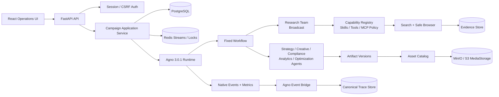

# ShopPilot

> 面向电商运营团队的 AI Commerce Operations Platform

ShopPilot 将市场调研、策略制定、内容创意、合规检查、人工审批、资产沉淀、效果分析和优化实验组织成一条可追踪、可审核、可复盘的运营流水线。

[](docs/architecture/agno-capability-audit.md)
[](https://fastapi.tiangolo.com/)
[](https://react.dev/)
[](compose.yaml)

## 项目定位

ShopPilot 不是通用聊天机器人，也不是开放式 Agent 编排器。它提供一个默认单管理员使用的电商运营工作台：运营者输入商品与目标，系统按固定业务流程调用受治理的 Agno Agent/Team/Workflow，生成研究证据、策略、创意、广告文本和文档资产；每个阶段必须经过人工审核后才能进入下一阶段。

核心原则：

- Agno-first：运行时使用 Agno 3.0.1 原生 `Agent`、`Team`、`Workflow`、`Skills`、`Toolkit`、`MCPTools`、`MediaStorage`、事件流和 metrics。
- Human-in-the-loop：研究、策略、创意、合规、广告交付、发布审批、分析和优化均有独立 Gate。
- Evidence-first：外部研究内容是不可信数据，结论需要绑定 EvidenceRecord 和 Citation。
- Asset-native：研究报告、Markdown、广告文案、图片和创意结果保存为带版本、哈希、血缘和审批绑定的资产。
- Observable by default：从 Campaign Run 到 Stage、Agent、Model、Tool/MCP、Evidence、Artifact 和 Asset 都可追踪。
- Safe by default：默认拒绝未授权能力，Replay 不联网，发布能力保持受控且不提供真实平台连接。

## 产品架构



### 固定业务流程

```text
输入
  → 市场调研
  → 策略
  → 创意
  → 合规
  → 广告交付
  → 发布审批
  → 效果分析
  → 优化实验
```

阶段状态包括 `locked`、`ready`、`running`、`pending_review`、`approved`、`rejected`、`revision_required`、`failed`、`skipped`。未批准阶段不会解锁下游执行；新版本会使旧审批和下游结果失效。

## 目录结构

```text
ShopPilot/
├── frontend/                         # React + TypeScript + Vite 运营前端
│   ├── src/App.tsx                   # 页面、导航、阶段工作区和审核交互
│   ├── src/api.ts                    # Cookie/CSRF API 客户端
│   ├── src/styles.css                # 产品界面样式
│   ├── Dockerfile                    # Nginx 静态部署镜像
│   └── nginx.conf                    # 前端与 API 反向代理
├── shopilot/
│   ├── app/                          # FastAPI 应用、认证、错误处理、静态兼容入口
│   ├── domain/                       # 阶段状态机、审核和领域契约
│   ├── runtime/                      # Agno Runtime Factory 和 Provider 适配
│   ├── agents/                       # 单职责业务 Agent
│   ├── teams/                        # 固定成员 Research Team
│   ├── workflows/                    # Campaign Workflow、Gate、Replay、资产输出
│   ├── capabilities/                 # Agent/Skill/Tool/MCP Registry 与 Policy
│   ├── evidence/                     # Search、Safe Browser、Citation、Conflict
│   ├── assets/                       # Asset Catalog、版本、哈希、存储和导出
│   ├── observability/                # Canonical Trace、Event Bridge、Redaction、Metrics
│   ├── infra/                        # PostgreSQL、Redis、MinIO/S3 基础设施
│   ├── harness/                      # Scenario、故障注入、评估和 Replay
│   └── worker.py                     # Redis Consumer；执行委托给固定业务 Workflow
├── alembic/                          # PostgreSQL 数据库迁移
├── docs/
│   ├── architecture/                 # Agno 能力审计和架构说明
│   ├── roadmap/                      # 产品演进路线
│   ├── development.md                # 开发、扩展和验收规范
│   └── platform-operations.md        # 部署、备份和运维说明
├── tests/                            # Agno、Evidence、Asset、Capability、Trace 测试
├── compose.yaml                      # PostgreSQL / Redis / MinIO / API / Worker / Web
├── Dockerfile                        # API 与 Worker 镜像
├── pyproject.toml                    # Python 依赖和 CLI 入口
├── uv.lock                           # Python 锁定依赖
└── .env.example                      # 配置模板，不包含真实密钥
```

## 快速开始

### Docker 推荐方式

要求：Docker Desktop、Docker Compose v2。

```powershell
Copy-Item .env.example .env
# 编辑 .env，至少填写 SHOPILOT_API_KEY
# 图片 API Key 可暂不配置
docker compose up --build -d
```

访问：

- 前端工作台：<http://127.0.0.1:8080>
- API：<http://127.0.0.1:8000>
- API 文档：<http://127.0.0.1:8000/docs>
- MinIO 控制台：<http://127.0.0.1:9001>

停止服务但保留数据：

```powershell
docker compose down
```

删除容器及本地数据卷：

```powershell
docker compose down -v
```

默认管理员：`admin` / `shopilot-admin`。生产环境必须通过 `SHOPILOT_ADMIN_PASSWORD` 覆盖默认密码。

## 配置

DeepSeek OpenAI-compatible 默认配置：

```env
SHOPILOT_RUNTIME_MODE=agno
SHOPILOT_PROVIDER=openai-compatible
SHOPILOT_MODEL_ID=deepseek-chat
SHOPILOT_BASE_URL=https://api.deepseek.com/v1
SHOPILOT_API_KEY=your-deepseek-key
```

重要配置：

| 变量 | 说明 |
| --- | --- |
| `SHOPILOT_RUNTIME_MODE` | `agno` 正式运行；`mock` 仅用于离线 Harness 和故障注入 |
| `SHOPILOT_SIDE_EFFECT_MODE` | `disabled`、`mock` 或受控模式；当前不提供真实平台发布 |
| `SHOPILOT_API_KEY` | Agno 模式必填，服务端读取，永不返回前端 |
| `SHOPILOT_MODEL_ID` | 默认 `deepseek-chat` |
| `SHOPILOT_BASE_URL` | OpenAI-compatible API 根地址 |
| `SHOPILOT_DATABASE_URL` | Docker 中由 Compose 指向 PostgreSQL |
| `SHOPILOT_REDIS_URL` | Redis Stream、锁、进度和短期状态 |
| `SHOPILOT_OBJECT_STORAGE_*` | MinIO 或 S3-compatible 对象存储 |
| `SHOPILOT_ADMIN_USERNAME/PASSWORD` | 单管理员登录凭证 |
| `SHOPILOT_PROVIDER_TIMEOUT` | Provider 超时秒数 |
| `SHOPILOT_RETRY_BUDGET` | 有限重试次数 |

图片能力是可选项。未配置图片服务时，UI 会明确显示未启用，文本、研究和文档资产流程仍可运行；离线测试可以使用 Mock 图片。

## 前端工作台

前端提供以下运营视图：

- 运营总览：运行中 Campaign、待审核阶段、资产和运行健康度。
- Agent 能力中心：Agent 成员、版本、Skill、Tool、MCP、模型策略和运行统计。
- 能力目录：受治理的 Skill、Tool、MCP Server，以及 side-effect、timeout、retry 和健康状态。
- Campaign 运行中心：固定阶段流程、阶段输入、结果、Trace、Evidence、Asset 和审核历史。
- Trace 调用树：Campaign → Stage → Team → Agent → Model/Tool/MCP 的层级执行过程。
- 资产中心：研究报告、创意、广告和图片的预览、下载、版本和血缘。

## API 概览

```text
POST /api/auth/login                         登录
GET  /api/agents                             Agent 能力列表
PUT  /api/agents/{agent_id}/bindings         更新能力绑定
GET  /api/capabilities/health                能力健康状态
POST /api/runs                               创建阶段化运行
GET  /api/runs/{run_id}/stages               阶段状态
POST /api/runs/{run_id}/stages/{id}/approve  阶段审批
POST /api/runs/{run_id}/stages/{id}/reject   驳回并创建新版本
GET  /api/runs/{run_id}/graph                运行图和 Trace Span
GET  /api/runs/{run_id}/events/stream        SSE 事件流
GET  /api/runs/{run_id}/evidence             Evidence 列表
GET  /api/runs/{run_id}/assets               运行资产
GET  /api/assets/{id}/versions/{version}/download
POST /api/runs/{run_id}/replay               Recorded Replay
GET  /health/live                            进程存活
GET  /health/ready                           配置和运行就绪
```

所有业务接口受 Session/Cookie 保护；写操作需要 CSRF Token。错误响应包含稳定 `error_code` 和 `request_id`。

## 开发与测试

本项目后续开发直接使用工程任务、架构文档、测试和变更记录闭环管理，不再使用 OpenSpec skill，也不新建 OpenSpec change。任何新增运行能力必须先审查 Agno 3.0.1 原生能力，禁止自研 Agent Runtime、Team Scheduler、通用 DAG 或 MCP Protocol。

本地安装：

```powershell
uv sync
uv run python -m compileall -q shopilot alembic
```

核心验证：

```powershell
uv run pytest tests/test_agno_capabilities.py tests/test_external_research.py tests/test_observability_platform.py -q
Set-Location frontend
npm ci
npm run build
Set-Location ..
docker compose config --quiet
docker compose build
```

真实 Provider smoke 必须显式执行，并且只允许研究或其他无副作用流程；不要把 API Key 写入代码、日志、Trace、Artifact、数据库或浏览器端。

## 安全边界

- Browser 只允许 HTTP(S)，阻断私网地址、URL 凭据、危险重定向、超大响应和非文本 MIME。
- 搜索结果、网页、上传文件和 MCP 响应都被视为不可信数据；疑似 Prompt Injection 只标记，不执行。
- Tool/MCP 默认拒绝，能力绑定需要版本化 Registry 和 Policy。
- Secret 只通过服务端 Credential Reference 使用，页面和 Trace 仅显示脱敏摘要。
- Asset 下载经过授权 API，不暴露对象存储路径，并附带安全响应头。
- Replay 默认复用记录结果，不访问外网、不调用真实图片生成、不执行发布副作用。
- PostgreSQL 是正式环境业务事实源；Redis 用于队列、锁、事件和缓存，不作为永久事实源。

## 非目标

当前版本不包含真实小红书/抖音发布、多用户 RBAC、用户自定义 DAG、动态 MCP 安装、视频真实生成和未经审核的自动发布。真实平台 Connector 必须作为独立设计和安全审查后的后续能力实现。

## 文档

- [开发与交付规范](docs/development.md)
- [平台运维说明](docs/platform-operations.md)
- [Agno 能力审计](docs/architecture/agno-capability-audit.md)
- [平台演进路线](docs/roadmap/agent-platform-evolution.md)
- [OpenSpec change 归档材料](openspec/changes/build-agent-capability-asset-observability-platform/)

## License

License 尚未单独声明。使用、分发或商业部署前，请先确认仓库所有者的授权条款。